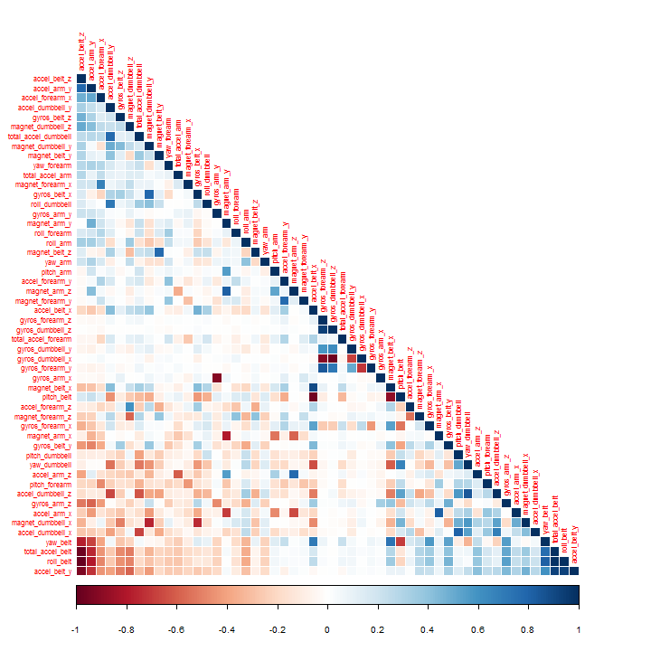
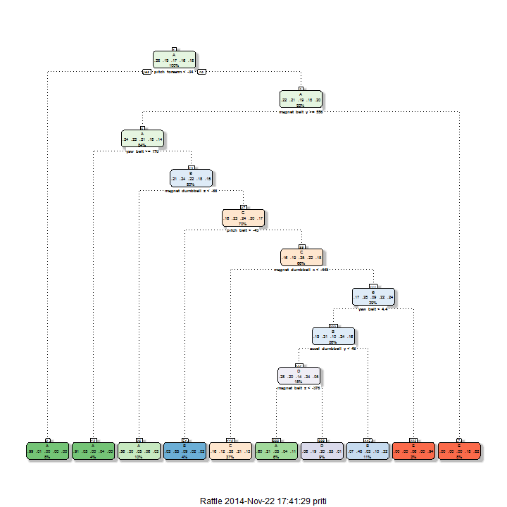

Human activity Recognition (Practical machine learning Project)
========================================================
In this project, we will explore the Weight Lifting Exercises dataset to investigate "how (well)" an activity was performed by the wearer.Six young health participants were asked to perform one set of 10 repetitions of the Unilateral Dumbbell Biceps Curl in five different fashions: exactly according to the specification (Class A), throwing the elbows to the front (Class B), lifting the dumbbell only halfway (Class C), lowering the dumbbell only halfway (Class D) and throwing the hips to the front (Class E). 
More information is available from the website [http://groupware.les.inf.puc-rio.br/har] (http://groupware.les.inf.puc-rio.br/har)(see the section on the Weight Lifting Exercise Dataset).

  Main goals of this project are:

1. Predict the manner in which they did the exercise depicted by the *classe* variable in training dataset.

2. Build a prediction model using different features, cross-validation technique and machine learning algorithm.

3. Calculate out of sample error.

4. Use the prediction model to predict 20 different test cases provided.

### Getting Data
 The training data for this project are available here:[https://d396qusza40orc.cloudfront.net/predmachlearn/pml-training.csv](https://d396qusza40orc.cloudfront.net/predmachlearn/pml-training.csv)

The test data are available here:[https://d396qusza40orc.cloudfront.net/predmachlearn/pml-testing.csv](https://d396qusza40orc.cloudfront.net/predmachlearn/pml-testing.csv)


```r
train_url<-"http://d396qusza40orc.cloudfront.net/predmachlearn/pml-training.csv"
test_url<-"http://d396qusza40orc.cloudfront.net/predmachlearn/pml-testing.csv"
if(!file.exists("pml_training.csv"))
  download.file(train_url,dest="pml_training.csv")
if(!file.exists("pml_testing.csv"))
  download.file(test_url,dest="pml_testing.csv")

har_train<-read.csv("pml_training.csv", stringsAsFactors=FALSE,na.strings = c("NA", ""))
dim(har_train)
```

```
## [1] 19622   160
```

```r
har_train$classe<-as.factor(har_train$classe)
har_test<-read.csv("pml_testing.csv", stringsAsFactors=FALSE)
dim(har_test)
```

```
## [1]  20 160
```

### Preprocessing data
- **Remove variables those have too many NA values**

```r
na_col_sum<-colSums(is.na(har_train))
table(na_col_sum)
```

```
## na_col_sum
##     0 19216 
##    60   100
```
Looking at above values it is clear that 60 variables have no NA values while the rest 100 have NA values for almost all the rows of the dataset, so we are going to ignore them using the following code .


```r
ignore_col <- na_col_sum >= 19000
tidy_har_train<-har_train[!ignore_col]
names(tidy_har_train)
```

```
##  [1] "X"                    "user_name"            "raw_timestamp_part_1"
##  [4] "raw_timestamp_part_2" "cvtd_timestamp"       "new_window"          
##  [7] "num_window"           "roll_belt"            "pitch_belt"          
## [10] "yaw_belt"             "total_accel_belt"     "gyros_belt_x"        
## [13] "gyros_belt_y"         "gyros_belt_z"         "accel_belt_x"        
## [16] "accel_belt_y"         "accel_belt_z"         "magnet_belt_x"       
## [19] "magnet_belt_y"        "magnet_belt_z"        "roll_arm"            
## [22] "pitch_arm"            "yaw_arm"              "total_accel_arm"     
## [25] "gyros_arm_x"          "gyros_arm_y"          "gyros_arm_z"         
## [28] "accel_arm_x"          "accel_arm_y"          "accel_arm_z"         
## [31] "magnet_arm_x"         "magnet_arm_y"         "magnet_arm_z"        
## [34] "roll_dumbbell"        "pitch_dumbbell"       "yaw_dumbbell"        
## [37] "total_accel_dumbbell" "gyros_dumbbell_x"     "gyros_dumbbell_y"    
## [40] "gyros_dumbbell_z"     "accel_dumbbell_x"     "accel_dumbbell_y"    
## [43] "accel_dumbbell_z"     "magnet_dumbbell_x"    "magnet_dumbbell_y"   
## [46] "magnet_dumbbell_z"    "roll_forearm"         "pitch_forearm"       
## [49] "yaw_forearm"          "total_accel_forearm"  "gyros_forearm_x"     
## [52] "gyros_forearm_y"      "gyros_forearm_z"      "accel_forearm_x"     
## [55] "accel_forearm_y"      "accel_forearm_z"      "magnet_forearm_x"    
## [58] "magnet_forearm_y"     "magnet_forearm_z"     "classe"
```

```r
sum(is.na(tidy_har_train))
```

```
## [1] 0
```
Now the tidy dataset don't have any NA values.   

- **Remove unrelevant variables**    
There are some unrelated variables those can be removed as they are unlikely to be have any relationship with dependent variable(classe).

```r
remove_var = c('X', 'user_name', 'raw_timestamp_part_1', 'raw_timestamp_part_2', 'cvtd_timestamp', 'new_window', 'num_window')
tidy_har_train <- tidy_har_train[, -which(names(tidy_har_train) %in% remove_var)]
dim(tidy_har_train)
```

```
## [1] 19622    53
```
Therefore, data can be now used for some exploratory analysis and prediction model.   

- **Check the variables that have extremely low variance (using nearZeroVar() of caret package )**

```r
library(caret)
```

```
## Loading required package: lattice
## Loading required package: ggplot2
```

```r
# only numeric variabls can be evaluated in this way.
nonZeroMetric<-nearZeroVar(tidy_har_train,saveMetrics=TRUE)
nzv_har_train = tidy_har_train[,nonZeroMetric[, 'nzv']==0]
dim(nzv_har_train)
```

```
## [1] 19622    53
```

- **Removing highly correlated variables**
We may want to remove highly correlated predictors from our analysis and replace them with weighted combinations of predictors. This may allow a more complete capture of the information available.

```r
library(corrplot)
corMat <- cor(nzv_har_train[, -length(nzv_har_train)])
corrplot(corMat, order = "FPC", method = "color", type = "lower", tl.cex = 0.7) 
```

 
This grid shows the correlation between pairs of the predictors in our dataset. From a high-level perspective darker blue and darker red squares indicate high positive and high negative correlations, respectively.
  We are going to remove those variable which have high correlation to reduce noise.we can use PCA(Principal component analysis) of caret but doing it in following way to make it easier to interprete predictors. 
  

```r
removecor = findCorrelation(corMat, cutoff = .9)
final_har_train = nzv_har_train[,-removecor]
dim(final_har_train)
```

```
## [1] 19622    46
```
### Data partitioning for cross-validation
We partition the nza_har_train dataset into training_har(60%) and validation_har(40%) data sets for cross validation


```r
inTrain<-createDataPartition(y=final_har_train$classe,p=0.6,list=FALSE)
training_har<-final_har_train[inTrain,]
validation_har<-final_har_train[-inTrain,]
dim(training_har); dim(validation_har)
```

```
## [1] 11776    46
```

```
## [1] 7846   46
```

### Model building
In  this section, we will build machine learning models for predicting the classe value based on the other features of the dataset.

#### Regression Tree
First. let's start with regression trees using features of training_har dataset as it's easy to interprete.

```r
treemodFit<-train(classe~.,method="rpart",data=training_har)
```

```
## Loading required package: rpart
## Loading required namespace: e1071
```

```r
print(treemodFit$finalModel)
```

```
## n= 11776 
## 
## node), split, n, loss, yval, (yprob)
##       * denotes terminal node
## 
##   1) root 11776 8428 A (0.28 0.19 0.17 0.16 0.18)  
##     2) pitch_forearm< -33.95 942    5 A (0.99 0.0053 0 0 0) *
##     3) pitch_forearm>=-33.95 10834 8423 A (0.22 0.21 0.19 0.18 0.2)  
##       6) magnet_belt_y>=555.5 9947 7538 A (0.24 0.23 0.21 0.18 0.14)  
##        12) yaw_belt>=169.5 470   43 A (0.91 0.049 0 0.043 0) *
##        13) yaw_belt< 169.5 9477 7227 B (0.21 0.24 0.22 0.18 0.15)  
##          26) magnet_dumbbell_z< -88.5 1232  537 A (0.56 0.3 0.05 0.063 0.028) *
##          27) magnet_dumbbell_z>=-88.5 8245 6255 C (0.16 0.23 0.24 0.2 0.17)  
##            54) pitch_belt< -42.85 504   78 B (0.034 0.85 0.085 0.018 0.018) *
##            55) pitch_belt>=-42.85 7741 5794 C (0.16 0.19 0.25 0.22 0.18)  
##             110) magnet_dumbbell_x< -447.5 4307 2675 C (0.16 0.12 0.38 0.21 0.13) *
##             111) magnet_dumbbell_x>=-447.5 3434 2477 B (0.17 0.28 0.092 0.22 0.24)  
##               222) yaw_belt< 4.4 3076 2119 B (0.19 0.31 0.096 0.24 0.16)  
##                 444) accel_dumbbell_y< 48.5 1819 1198 D (0.28 0.2 0.14 0.34 0.047)  
##                   888) magnet_belt_z< -375.5 730  290 A (0.6 0.21 0.045 0.036 0.11) *
##                   889) magnet_belt_z>=-375.5 1089  494 D (0.059 0.19 0.2 0.55 0.0064) *
##                 445) accel_dumbbell_y>=48.5 1257  655 B (0.066 0.48 0.033 0.1 0.32) *
##               223) yaw_belt>=4.4 358   20 E (0 0 0.056 0 0.94) *
##       7) magnet_belt_y< 555.5 887  163 E (0.0023 0.0011 0.0023 0.18 0.82) *
```
Let's plot treemodfit$finalmodel using fancyRpartPlot of *rattle* package

```r
library(rattle)
```

```
## Rattle: A free graphical interface for data mining with R.
## Version 3.1.0 Copyright (c) 2006-2014 Togaware Pty Ltd.
## Type 'rattle()' to shake, rattle, and roll your data.
```

```r
fancyRpartPlot(treemodFit$finalModel)
```

```
## Loading required package: rpart.plot
## Loading required package: RColorBrewer
```

 
##### cross validation of regression tree model
We are going to check the performance of the tree on the validation_har data by cross validation.

```r
tree_prediction=predict(treemodFit,validation_har[,-length(validation_har)])
confusionMatrix(tree_prediction,validation_har$classe)
```

```
## Confusion Matrix and Statistics
## 
##           Reference
## Prediction    A    B    C    D    E
##          A 1663  338   60  111   79
##          B   48  710   59   82  280
##          C  479  332 1074  613  394
##          D   41  135  165  372    6
##          E    1    3   10  108  683
## 
## Overall Statistics
##                                         
##                Accuracy : 0.574         
##                  95% CI : (0.563, 0.585)
##     No Information Rate : 0.284         
##     P-Value [Acc > NIR] : <2e-16        
##                                         
##                   Kappa : 0.461         
##  Mcnemar's Test P-Value : <2e-16        
## 
## Statistics by Class:
## 
##                      Class: A Class: B Class: C Class: D Class: E
## Sensitivity             0.745   0.4677    0.785   0.2893   0.4736
## Specificity             0.895   0.9259    0.719   0.9471   0.9809
## Pos Pred Value          0.739   0.6022    0.371   0.5174   0.8484
## Neg Pred Value          0.898   0.8788    0.941   0.8718   0.8922
## Prevalence              0.284   0.1935    0.174   0.1639   0.1838
## Detection Rate          0.212   0.0905    0.137   0.0474   0.0871
## Detection Prevalence    0.287   0.1503    0.369   0.0916   0.1026
## Balanced Accuracy       0.820   0.6968    0.752   0.6182   0.7273
```
The accuracy o.49 is too low.The single tree is not good enough, so we are going to use bootstrap to improve the accuracy. We are going to try random forests.
#### Random Forest
Random forests build lots of bushy trees, and then average them to reduce the variance.

 Let's build our model using the Random Forest machine learning technique.

```r
rfmodFit<-train(classe~.,data=training_har,method="rf",trControl = trainControl(method = "cv",number = 4),importance=TRUE)
```

```
## Loading required package: randomForest
## randomForest 4.6-10
## Type rfNews() to see new features/changes/bug fixes.
```

```r
# Result of the random forest model
print(rfmodFit)
```

```
## Random Forest 
## 
## 11776 samples
##    45 predictor
##     5 classes: 'A', 'B', 'C', 'D', 'E' 
## 
## No pre-processing
## Resampling: Cross-Validated (4 fold) 
## 
## Summary of sample sizes: 8832, 8832, 8833, 8831 
## 
## Resampling results across tuning parameters:
## 
##   mtry  Accuracy  Kappa   Accuracy SD  Kappa SD
##    2    0.9850    0.9810  0.0009723    0.001232
##   23    0.9891    0.9862  0.0012066    0.001527
##   45    0.9856    0.9817  0.0022250    0.002817
## 
## Accuracy was used to select the optimal model using  the largest value.
## The final value used for the model was mtry = 23.
```

```r
VarImpPlot(rfmodFit$finalModel,)
```

```
## Error: could not find function "VarImpPlot"
```

we can see which variables have higher impact on the prediction.
#### In sample error for random forest model
Now we calculate the **in sample** accuracy which is the prediction accuracy of our model on the training data set.

```r
train_prediction<-predict(rfmodFit,training_har[,-length(training_har)])
inSampleAccuracy<-sum(train_prediction==training_har$classe)/length(train_prediction)
inSampleAccuracy
```

```
## [1] 1
```

```r
inSampleError<- 1 - inSampleAccuracy
inSampleError
```

```
## [1] 0
```

```r
ein<-inSampleError * 100
paste0("In sample error estimation: ", round(ein, digits = 2), "%")
```

```
## [1] "In sample error estimation: 0%"
```
### Out of Sample Error for random forest model
Now we'll estimate out of Sample error on cv_testing_har.

```r
validation_prediction<-predict(rfmodFit,validation_har[,-length(validation_har)])
outOfSampleAccuracy<-sum(validation_prediction==validation_har$classe)/length(validation_prediction)
outOfSampleAccuracy
```

```
## [1] 0.9925
```

```r
outOfSampleError<- 1- outOfSampleAccuracy
outOfSampleError
```

```
## [1] 0.00752
```

```r
eout <- outOfSampleError * 100
paste0("Out of sample error estimation: ", round(eout, digits = 2), "%")
```

```
## [1] "Out of sample error estimation: 0.75%"
```
So accuracy of our randomforest model is 0.9925% which's very good.It's a bit slow but we've to trade this  off for accuracy of this model.Out of sample  error0.752% is very small as expected. 
### Prediction Assignment  
In this section, we apply the above  random forest machine learning algorithm to each of the 20 test cases in the testing data set provided.

```r
answers <- predict(rfmodFit, har_test)
answers <- as.character(answers)
answers
```

```
##  [1] "B" "A" "B" "A" "A" "E" "D" "B" "A" "A" "B" "C" "B" "A" "E" "E" "A"
## [18] "B" "B" "B"
```
#### Write up for submission
Finally, we write the answers to files as specified by the course instructor using the following code segment.


```r
pml_write_files = function(x) {
    n = length(x)
    for (i in 1:n) {
        filename = paste0("problem_id_", i, ".txt")
        write.table(x[i], file = filename, quote = FALSE, row.names = FALSE, 
            col.names = FALSE)
    }
}

pml_write_files(answers)
```
